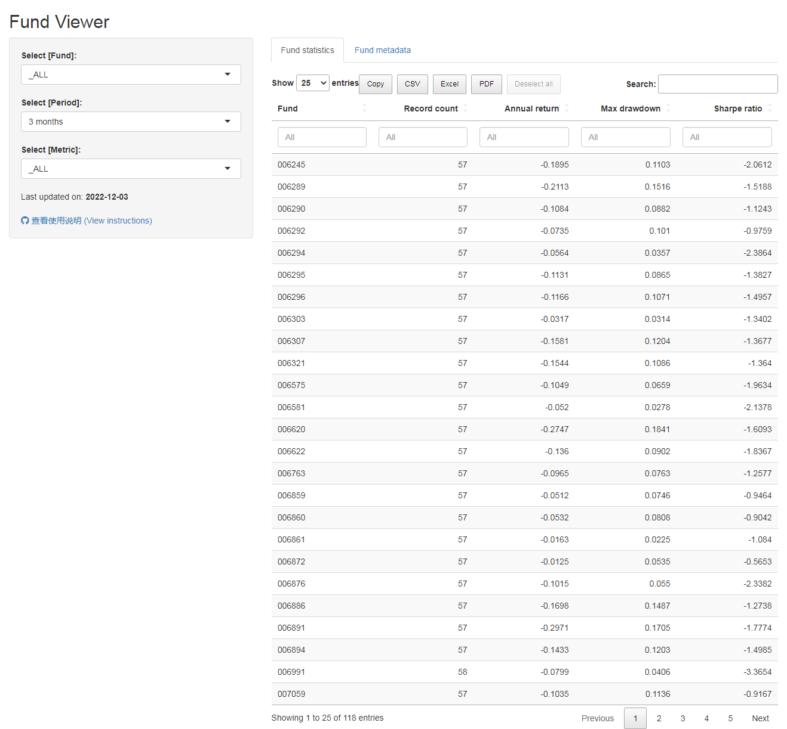
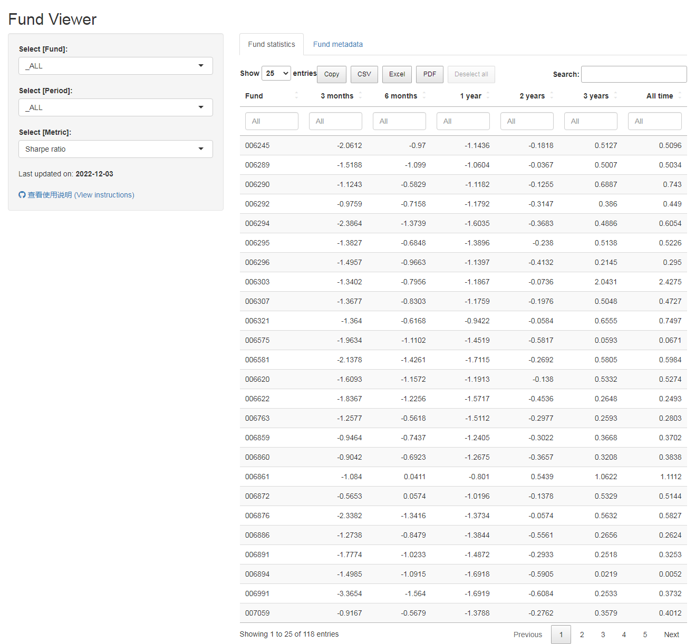
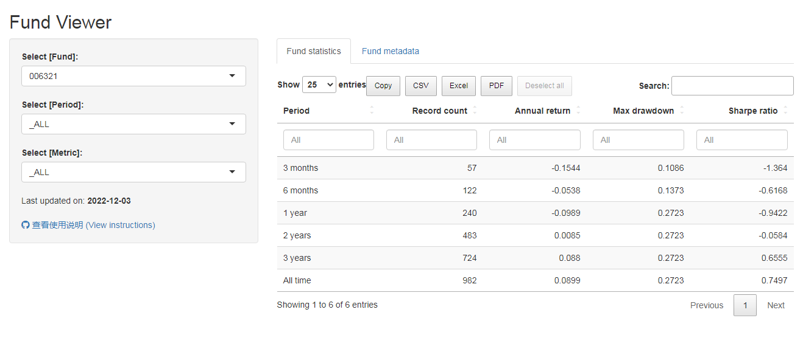
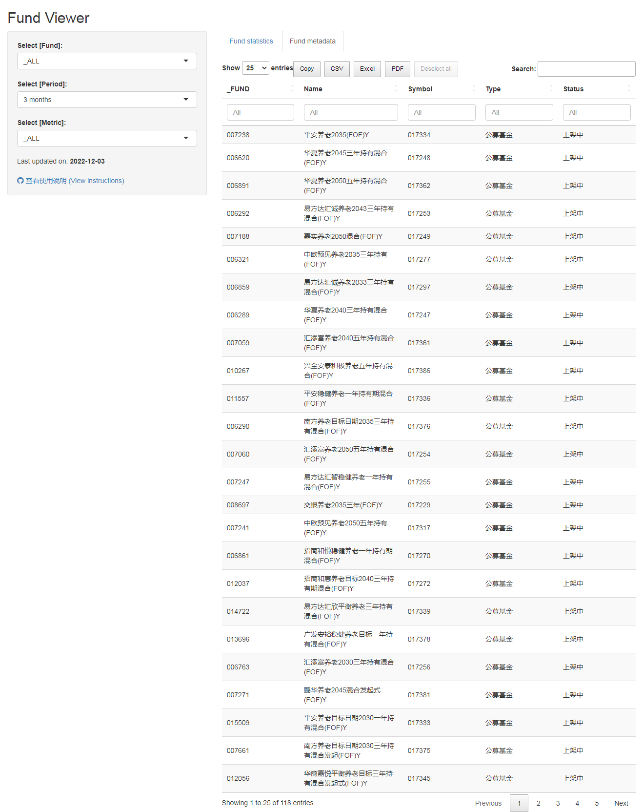

基金查看器 (Fund viewer)
================

- <a href="#披露事项-disclosure" id="toc-披露事项-disclosure">披露事项
  (Disclosure)</a>
- <a href="#简介-introduction" id="toc-简介-introduction">简介
  (Introduction)</a>
- <a href="#用法-implementation" id="toc-用法-implementation">用法
  (Implementation)</a>
  - <a href="#fund-viewer应用程序-fund-viewer-application"
    id="toc-fund-viewer应用程序-fund-viewer-application">Fund viewer应用程序
    (Fund viewer application)</a>
  - <a href="#定制基金数据和指标-customizing-fund-data-and-metrics"
    id="toc-定制基金数据和指标-customizing-fund-data-and-metrics">定制基金数据和指标
    (Customizing fund data and metrics)</a>

## 披露事项 (Disclosure)

本代码库的所有基金数据均从因特网上获得，计算指标仅供参考，在法律允许的范围内不构成任何投资建议。本代码库的作者不保证数据、指标和代码的准确性及合理性，也不应当被要求对使用本代码库而导致的任何损失负责。本代码库的所有内容仅供学习交流，禁止任何商业化用途。如中英文两版内容有出入，请以英文版内容为准。**使用本代码库的任何人均在此声明：不可撤回地同意上述披露事项。**

All fund information and history data in this repository were obtained
from the Internet. The computed metrics are for reference only. Neither
the data nor the metrics constitute any form of investment suggestions
under any circumstances, to the extent permitted by applicable law. The
author of this repository do not guarantee the accuracy and rationality
of the data, the metrics and the code, and should not be held liable for
any loss due to the use of this repository. All content in this
repository is used solely for study and discussion, and no commercial
use is permitted. If content differs between the Chinese and English
versions, please refer to the English version for accuracy. **Anyone who
uses this repository claims herein: irrevocably agree with the
aforementioned disclosure.**

## 简介 (Introduction)

2022年11月25日，中国部分城市的个人养老金正式落地。随之而来的是可供购买的上百个养老基金的Y份额。如何量化地挑选这些基金？本代码库就这个问题进行了初步的探索。

On Nov. 25th, 2022, personal pension was formally put forward in part of
the cities in China. Following this was the Y share of about a hundred
pension funds. How to choose wisely from these pension funds in a
quantitative way? This repository provided a preliminary exploration.

## 用法 (Implementation)

### Fund viewer应用程序 (Fund viewer application)

如果只需要查看基金指标和元数据，请访问[此链接](https://zxr6.shinyapps.io/fund_viewer/)。应用程序页面大约需要15-30秒完成加载，请耐心等待。此应用程序内的数据会不定期更新。应用程序的使用方法和示例如下：

If only viewing fund metrics and metadata, please visit [this
site](https://zxr6.shinyapps.io/fund_viewer/). The application page may
completely load in 15-30 seconds, so please be patient. The data in the
application will update from time to time. The instructions and examples
are as follows:

应用程序分为左右两个面板：左侧面板包含若干选择框，用于选择维度视角
(基金、时间段和指标)； 右侧面板包含若干标签页，用于查看数据表格
(详见下方描述)。标签页中的所有表格均支持查找、过滤、选择和导出
(剪贴板、CSV、Excel和PDF)。

The application consists of two panels: the one on the left with select
boxes to choose dimension view ports (funds, periods and metrics), while
the one on the right with tabs to view data tables (check below for
details). Search, filtration, selection and export (clipboard, CSV,
Excel and PDF) are supported in all tables in the tabs.

- `Fund statistics`标签页:
  你可以选择不同的维度来查看不同情境下的基金指标 (示例1-3)。

- `Fund statistics` tab: You can select different dimensions to view
  fund metrics under different circumstances (examples 1-3).

- `Fund metadata`标签页: 你可以查看基金元数据 (示例4)。

- `Fund metadata` tab: You can also view fund metadata in the (example
  4).

**示例1**: 在指定时间段内，查看所有基金的所有计算指标。

**Example 1**: In a given period, inspect all computed metrics of all
funds.

<!-- -->

**示例2**: 对指定指标，查看所有基金在不同时间段下的表现。

**Example 2**: For a given metric, inspect the performance of all funds
across different time periods.

<!-- -->

**示例3**: 对指定基金，查看不同时间段下的所有指标。

**Example 3**: For a given fund, inspect all metrics across different
time periods.

<!-- -->

**示例4**: 查看基金元数据。

**Example 4**: Inspect fund metadata.

<!-- -->

如果需要定制基金数据和指标，请阅读后续内容。

If customizing fund data and metrics, please read the following.

### 定制基金数据和指标 (Customizing fund data and metrics)

以下内容需要使用R语言编程，请确认自己具备相应的知识和技能。

The following requires programming in R language. Please ensure your
knowledge and competence.

软件要求：[R](https://cloud.r-project.org/) (\>= 4.0.0),
[RStudio](https://rstudio.com/products/rstudio/download/)

Software requirements: [R](https://cloud.r-project.org/) (\>= 4.0.0),
[RStudio](https://rstudio.com/products/rstudio/download/)

首先，在RStudio中打开工程文件，运行`install.packages("renv")`在RStudio中安装`renv`软件包，并运行`renv::activate()`
和`renv::restore()`以确保下载并安装正确版本的软件包。

First, open project file in RStudio. Run `install.packages("renv")` to
install `renv` package. Run `renv::activate()` and `renv::restore()` to
ensure the project has the right versions of packages downloaded and
installed.

接着，在`lookup`文件夹中放入待处理的基金信息，例如从网页上复制的文本
(示例：
`lookup/pension_funds_20221203.txt`)，并运行`metadata.R`生成`data.frame`作为基因元数据，其行名
(必需)
为抓取历史数据用的基金代号。你可能需要调整代码以适应不同的输入格式。

Then, put into the `lookup` folder the fund information (e.g. text
copied from websites). Check for example:
`lookup/pension_funds_20221203.txt`. Run `metadata.R` to generate a
`data.frame` as fund metadata with row names (required) as symbols to
scrape funds’ history data. You may need to twitch the code to fit
different input formats.

然后，运行`script.R`抓取基金历史数据和计算指标。该脚本使用基金元数据的行名作为代号进行历史数据的抓取。通常情况下，Y份额成立时间较其它份额更短，因此需要查询每个基金中历史最长份额的数据以得到更准确的统计结果。在这个情况下，需要以转换份额后的代号作为行名。你可以调整代码以更改代号的对应关系，以及增加或替换需要计算的基金指标和时间段。

Next, run `script.R` to scrape funds’ history data and compute metrics.
The script uses the row names of the metadata as symbols to scrape the
history data. Usually, Y share is established much later than the
others, and therefore the share with the longest history of each fund
should be used to query data for statistics at higher accuracy. In this
way, the symbols of the converted shares should be used as row names.
You can twitch the code to change the mapping of symbols, and add or
replace the computed metrics or time periods.

最后，打开`app/fund_viewer/app.R`，运行Shiny应用程序查看基金指标和元数据。应用程序的使用方法详见[相关章节](#fund-viewer应用程序-fund-viewer-application)。

Finally, open `app/fund_viewer/app.R` and run the Shiny application to
view fund metrics and metadata. For the instructions to the application,
please refer to [the corresponding
section](#fund-viewer应用程序-fund-viewer-application).
